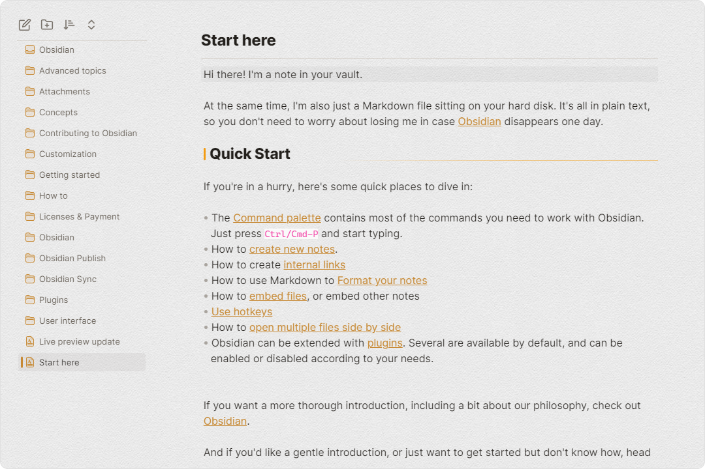
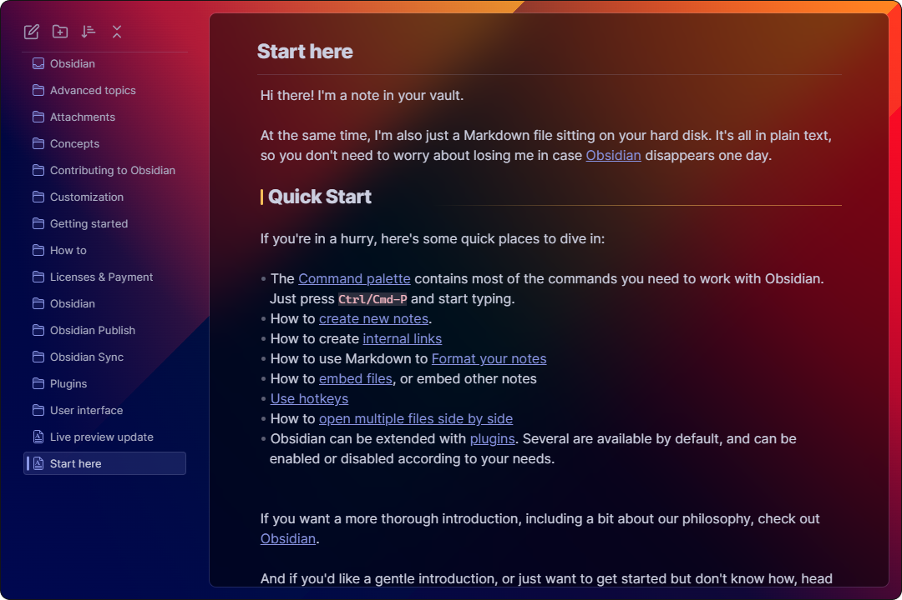

# obsidian-border

A clean and highly customisable theme for obsidian.md.

   

## Feature

### Auto hide

Enable in [style settings](https://github.com/mgmeyers/obsidian-style-settings) plugin.
(This feature requires [Obsidian 1.1.8 - Electron 21](https://github.com/obsidianmd/obsidian-releases/releases/tag/v1.1.8-E21) or higher)

### Card layout

Enable in [style settings](https://github.com/mgmeyers/obsidian-style-settings) plugin.

### Highly customizable

---

Create your own UI style using [style settings](https://github.com/mgmeyers/obsidian-style-settings) plugin. Here are some presets:

(Usage: Copy code from link, paste it into style settings and restart obsidian.)

+ [Fresh](https://github.com/Akifyss/obsidian-border/blob/main/presets/Fresh.json)

+ [Paper-like](https://github.com/Akifyss/obsidian-border/blob/main/presets/Paper-like.json)

+ [Translucent](https://github.com/Akifyss/obsidian-border/blob/main/presets/Translucent.json)

(Extra step: Enable "translucent window" in Setting-Appearance)

+ [Glassmorphism](https://github.com/Akifyss/obsidian-border/blob/main/presets/Glassmorphism.json)

<h4>More presets</h4>

<ul>
<li>WIP...</li>
</ul>

## Credits

+ [@subframe7536](https://github.com/subframe7536)'s [Maple theme](https://github.com/subframe7536/obsidian-theme-maple), for the beautiful outline style and other awesome components.([buy subframe7536 a coffee](https://www.buymeacoffee.com/subframe753))
+ [@kepano](https://github.com/kepano)'s [Minimal](https://github.com/kepano/obsidian-minimal), for the auto-hide tab title bar.([buy kepano a coffee](https://www.buymeacoffee.com/kepano))
