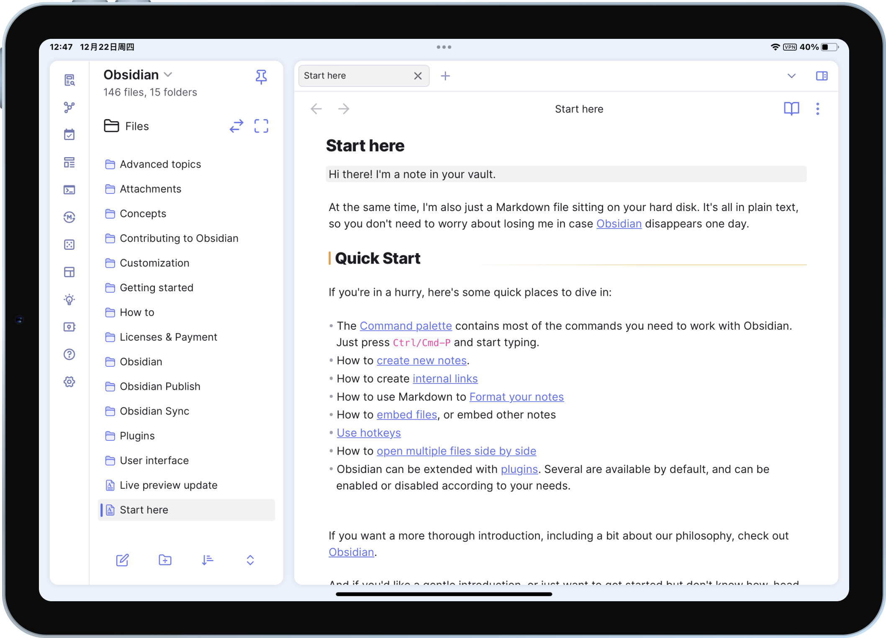

# obsidian-border

A theme for obsidian.md, built on Windows.

## Feature

### Customize UI color

Your accent color setting will affect UI elements.

### Auto hide

Elements on **Border** (top tab bar, ribbon menu and status bar) can be autohidden (This feature needs [style settings](https://github.com/mgmeyers/obsidian-style-settings) plugin to turn on)

**Note**: This feature requires [Obsidian 1.1.8 - Electron 21](https://github.com/obsidianmd/obsidian-releases/releases/tag/v1.1.8-E21) or higher

### Mobile support

Card layout (pad only)(need [style settings](https://github.com/mgmeyers/obsidian-style-settings) plugin)

