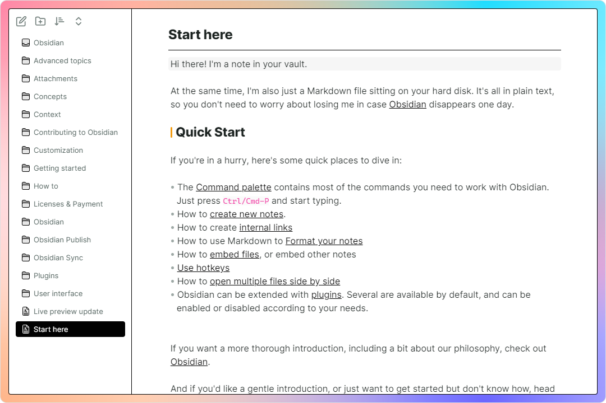
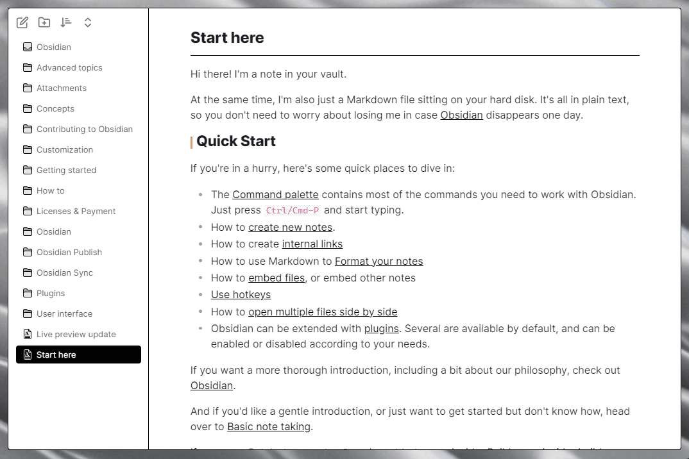

# obsidian-border

A clean and highly customisable theme for obsidian, recommended for use with [style settings](https://github.com/mgmeyers/obsidian-style-settings).

    

## Feature

### Auto hide

Enable in [style settings](https://github.com/mgmeyers/obsidian-style-settings) plugin.
(This feature requires [Obsidian 1.1.8 - Electron 21](https://github.com/obsidianmd/obsidian-releases/releases/tag/v1.1.8-E21) or higher)

### Card layout

Enable in [style settings](https://github.com/mgmeyers/obsidian-style-settings) plugin.

### Highly customizable

---

Create your own UI style using [style settings](https://github.com/mgmeyers/obsidian-style-settings) plugin. Here are some presets:

#### Presets

(**Presets Usage**: Copy code from link, paste it into style settings and restart obsidian.)

+ [Fresh](https://github.com/Akifyss/obsidian-border/blob/main/presets/Fresh.json) (Light Mode)

+ [Boundary](https://github.com/Akifyss/obsidian-border/blob/main/presets/Boundary.json) (Light Mode)

+ [Neumorphism](https://github.com/Akifyss/obsidian-border/blob/main/presets/Neumorphism.json) (Light Mode)

+ [Translucent](https://github.com/Akifyss/obsidian-border/blob/main/presets/Translucent.json) (Dark Mode)
(**Extra step**: Enable "translucent window" in Setting-Appearance)

+ [Sunset](https://github.com/Akifyss/obsidian-border/blob/main/presets/Sunset.json) (Dark Mode)

#### [Presets full list](https://github.com/Akifyss/obsidian-border/blob/main/presets.md)

<ul>
<li><a href="https://github.com/Akifyss/obsidian-border/blob/main/presets/Side.json">Side</a> (Light Mode)</li>

<li><a href="https://github.com/Akifyss/obsidian-border/blob/main/presets/Paper-like.json">Paper-like</a> (Light Mode)</li>

<li><a href="https://github.com/Akifyss/obsidian-border/blob/main/presets/Glassmorphism.json">Glassmorphism</a> (Dark Mode)</li>

<li><a href="https://github.com/Akifyss/obsidian-border/blob/main/presets/Lightup.json">Lightup</a> (Dark Mode)</li>

<li><a href="https://github.com/Akifyss/obsidian-border/blob/main/presets/Mint.json">Mint</a> (Light Mode)</li>

<li><a href="https://github.com/Akifyss/obsidian-border/blob/main/presets/Silver.json">Silver</a> (Light Mode)</li>

<li>WIP...</li>
</ul>

### Miscellaneous

#### Alternate checkboxes

#### New icons and illustrations

#### Active line highlight and hovered line indicator

## Credits

+ [@subframe7536](https://github.com/subframe7536)'s [Maple theme](https://github.com/subframe7536/obsidian-theme-maple), for the beautiful outline style and other awesome components.([buy subframe7536 a coffee](https://www.buymeacoffee.com/subframe753))
+ [@kepano](https://github.com/kepano)'s [Minimal](https://github.com/kepano/obsidian-minimal), for the auto-hide tab title bar.([buy kepano a coffee](https://www.buymeacoffee.com/kepano))
