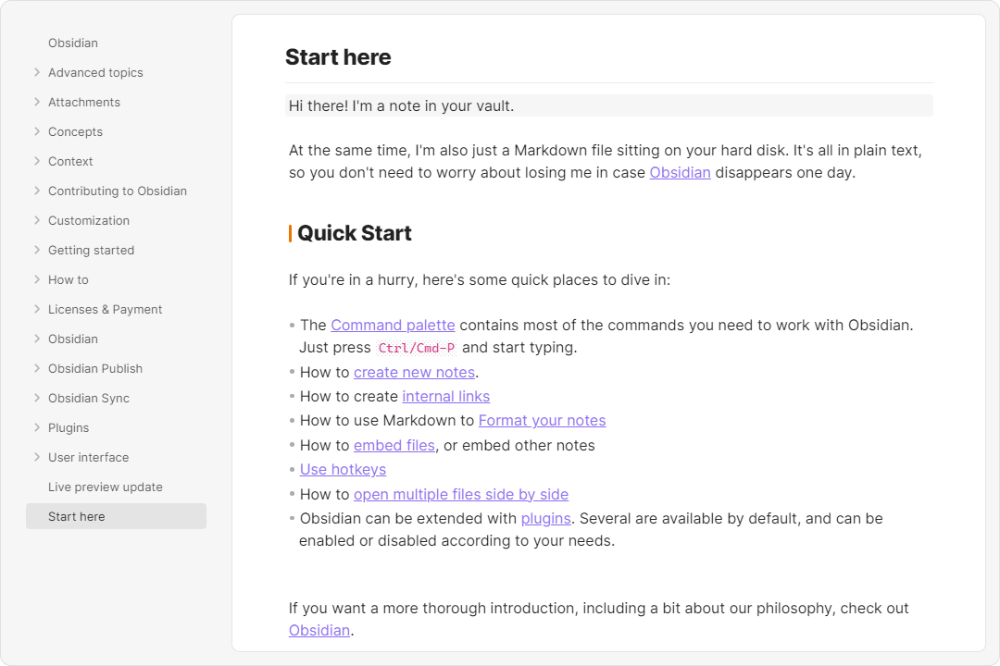

# obsidian-border

A clean and highly customisable theme for obsidian.

    

## Feature

> Highly recommended for use with [style settings](https://github.com/mgmeyers/obsidian-style-settings) plugin.

### Auto hide

Enable in [style settings](https://github.com/mgmeyers/obsidian-style-settings) plugin.

### Card layout

Enable in [style settings](https://github.com/mgmeyers/obsidian-style-settings) plugin.

### Hover line indicator

Enable in [style settings](https://github.com/mgmeyers/obsidian-style-settings) plugin.

### Highly customizable

---

Create your own UI style using [style settings](https://github.com/mgmeyers/obsidian-style-settings) plugin. Here are some presets:

#### [Presets](https://github.com/Akifyss/obsidian-border/blob/main/presets.md)

(**Presets Usage**: Copy code from link, paste it into style settings and restart obsidian.)

+ [Obsidian-default-light-alt](https://github.com/Akifyss/obsidian-border/blob/main/presets/Obsidian-default-light-alt.json) (Light Mode)

+ [Boundary](https://github.com/Akifyss/obsidian-border/blob/main/presets/Boundary.json) (Light Mode)

+ [Neumorphism](https://github.com/Akifyss/obsidian-border/blob/main/presets/Neumorphism.json) (Light Mode)

+ [Translucent](https://github.com/Akifyss/obsidian-border/blob/main/presets/Translucent.json) (Dark Mode)
(**Extra step**: Enable "translucent window" in Setting-Appearance)

+ [Sunset](https://github.com/Akifyss/obsidian-border/blob/main/presets/Sunset.json) (Dark Mode)

+ [Borderless](https://github.com/Akifyss/obsidian-border/blob/main/presets/Borderless.json) (Dark Mode)

#### ➡️ [Presets full list](https://github.com/Akifyss/obsidian-border/blob/main/presets.md)

### Miscellaneous

#### Alternate checkboxes

#### Alternate callout style

[import](https://github.com/Akifyss/obsidian-border/blob/main/presets.md#callout-style)

#### Customizable new tab

## Credits

+ [@subframe7536](https://github.com/subframe7536)'s [Maple theme](https://github.com/subframe7536/obsidian-theme-maple), for the beautiful outline style and other awesome components.([buy subframe7536 a coffee](https://www.buymeacoffee.com/subframe753))
+ [@kepano](https://github.com/kepano)'s [Minimal](https://github.com/kepano/obsidian-minimal), for the auto-hide tab title bar.([buy kepano a coffee](https://www.buymeacoffee.com/kepano))
+ [@hydescarf](https://github.com/hydescarf)'s [Mado Miniflow](https://github.com/hydescarf/Obsidian-Theme-Mado-Miniflow), for the motion and layout inspiration.
