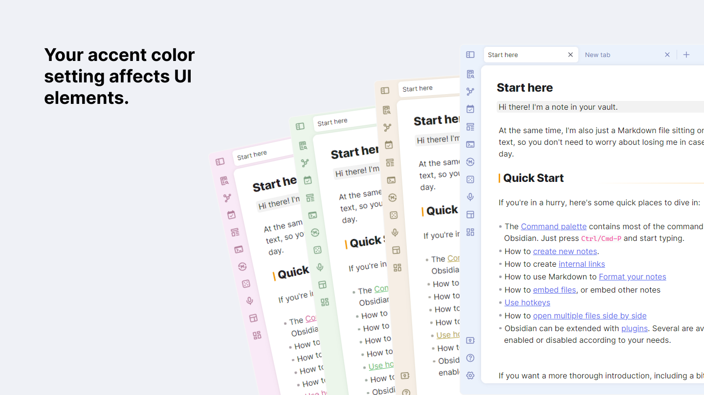

# obsidian-border

A theme for obsidian.md, built on Windows.

## Feature

### Auto hide

Enable in [style settings](https://github.com/mgmeyers/obsidian-style-settings) plugin.
(This feature requires [Obsidian 1.1.8 - Electron 21](https://github.com/obsidianmd/obsidian-releases/releases/tag/v1.1.8-E21) or higher)

### Card layout

Enable in [style settings](https://github.com/mgmeyers/obsidian-style-settings) plugin.

### Highly customizable

Customise your own UI style with [style settings](https://github.com/mgmeyers/obsidian-style-settings) plugin:

+ pink style

+ Paper-like

+ Translucent window

+ Glassmorphism

## Credits

+ [@subframe7536](https://github.com/subframe7536)'s [Maple theme](https://github.com/subframe7536/obsidian-theme-maple), for the beautiful outline style.
+ [@kepano](https://github.com/kepano)'s [Minimal](https://github.com/kepano/obsidian-minimal), for the auto-hide tab title bar.
