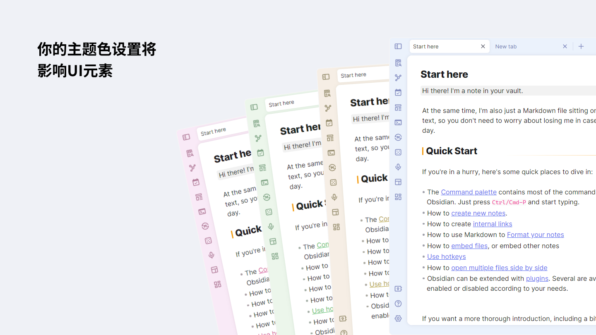

# obsidian-border

A theme for obsidian.md, built on Windows.

## Feature

### Customize UI color

Accent color setting will affect UI elements.

### Use [style settings](https://github.com/mgmeyers/obsidian-style-settings) plugin to turn on/off some features

+ ribbon menu auto hide

+ card layout (pad only)

