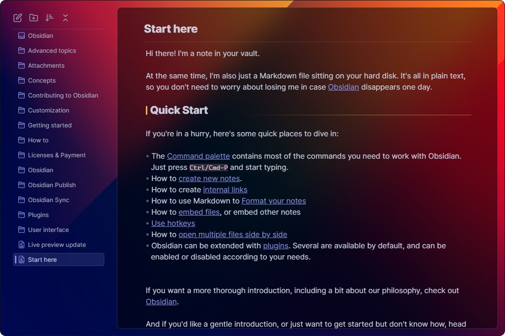

# obsidian-border

[English](https://github.com/Akifyss/obsidian-border/blob/main/README.md)

一个干净且高度可定制的obsidian主题。

   

## 特性

### 自动隐藏

在[style settings](https://github.com/mgmeyers/obsidian-style-settings)插件中启用。
(此特性需要 [Obsidian 1.1.8 - Electron 21](https://github.com/obsidianmd/obsidian-releases/releases/tag/v1.1.8-E21) 或更高版本)

### 卡片式布局

在[style settings](https://github.com/mgmeyers/obsidian-style-settings) 启用。

### 高度可定制

---

用[style settings](https://github.com/mgmeyers/obsidian-style-settings) 插件创建你自己的UI风格。以下是一些预设:

#### 预设

（**预设用法**: 复制链接中的代码, 粘贴进style settings中，然后重启obsidian。）

+ [Fresh](https://github.com/Akifyss/obsidian-border/blob/main/presets/Fresh.json) （亮色模式）

+ [Paper-like](https://github.com/Akifyss/obsidian-border/blob/main/presets/Paper-like.json) （亮色模式）

+ [Translucent](https://github.com/Akifyss/obsidian-border/blob/main/presets/Translucent.json) （暗色模式）
(**额外步骤**: 在“设置-外观”中启用半透明效果)

+ [Glassmorphism](https://github.com/Akifyss/obsidian-border/blob/main/presets/Glassmorphism.json) （暗色模式）

<h4>更多预设</h4>

<ul>
<li><a href="https://github.com/Akifyss/obsidian-border/blob/main/presets/Mint.json">Mint</a> （亮色模式）</li>

</ul>

### 杂项

#### 备用复选框

