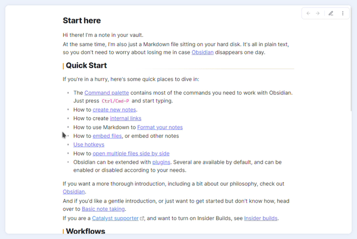
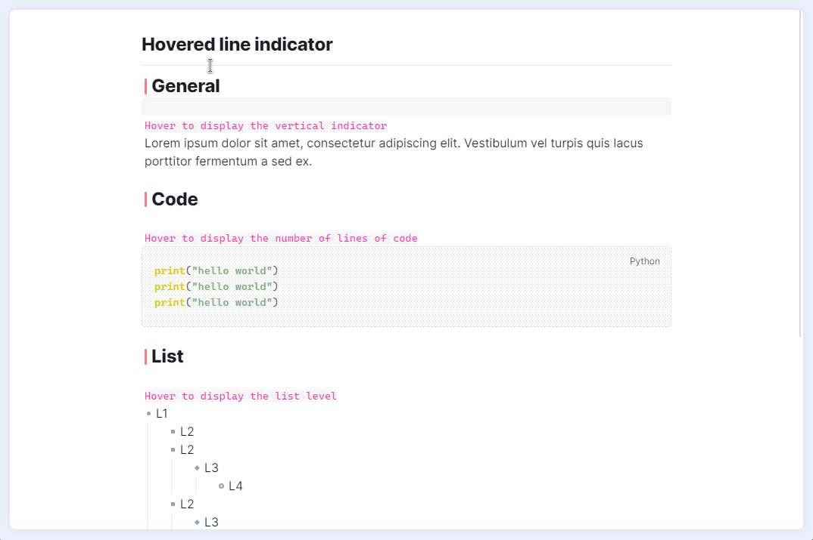
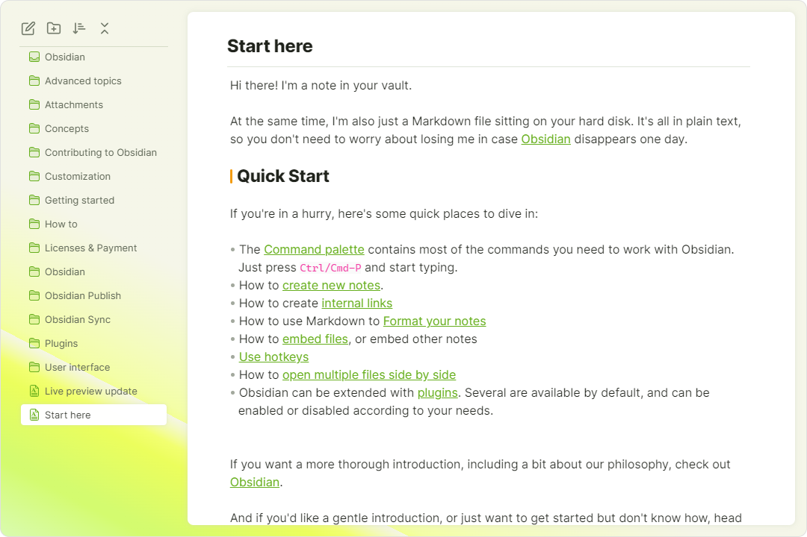
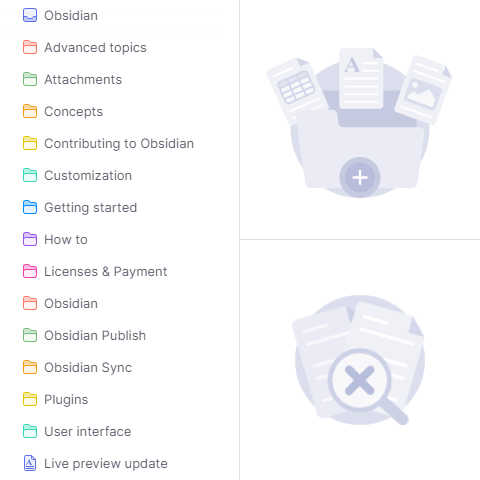

# obsidian-border

一个干净且高度可定制的obsidian主题。

   

## 特性

> **⚠️ 注意**：此主题的部分功能需要**安装程序**版本（不是指APP当前版本） > v1.1.8 才能正常工作。如果不是，可以在[这里](https://obsidian.md/download)重新下载安装obsidian来升级**安装程序**版本。可以在“设置-关于-APP”处查看**安装程序**版本
> 

> 强烈推荐与[style settings](https://github.com/mgmeyers/obsidian-style-settings)插件一起使用.

### 自动隐藏

在[style settings](https://github.com/mgmeyers/obsidian-style-settings)插件中启用。

需要**安装程序**版本（不是指APP当前版本） > v1.1.8

### 卡片式布局

在[style settings](https://github.com/mgmeyers/obsidian-style-settings) 启用。

### 悬停行指示器

在[style settings](https://github.com/mgmeyers/obsidian-style-settings)插件中启用。

需要**安装程序**版本（不是指APP当前版本） > v1.1.8

### 高度可定制

---

用[style settings](https://github.com/mgmeyers/obsidian-style-settings) 插件创建你自己的UI风格。以下是一些预设:

#### 预设

（**预设用法**: 复制链接中的代码, 粘贴进style settings中，然后重启obsidian。）

+ [Fresh](https://github.com/Akifyss/obsidian-border/blob/main/presets/Fresh.json) （亮色模式）

+ [Boundary](https://github.com/Akifyss/obsidian-border/blob/main/presets/Boundary.json) （亮色模式）

+ [Neumorphism](https://github.com/Akifyss/obsidian-border/blob/main/presets/Neumorphism.json) （亮色模式）

+ [Sunset](https://github.com/Akifyss/obsidian-border/blob/main/presets/Sunset.json) （暗色模式）

+ [Translucent](https://github.com/Akifyss/obsidian-border/blob/main/presets/Translucent.json) （暗色模式）
(**额外步骤**: 在“设置-外观”中启用半透明效果)

+ [Lightdown-pink](https://github.com/Akifyss/obsidian-border/blob/main/presets/Lightdown-pink.json)（暗色模式）

#### ➡️ [预设的完整列表](https://github.com/Akifyss/obsidian-border/blob/main/presets.md)

### 杂项

#### 备用复选框

#### 新图标和插画

#### 可自定义的新标签页

