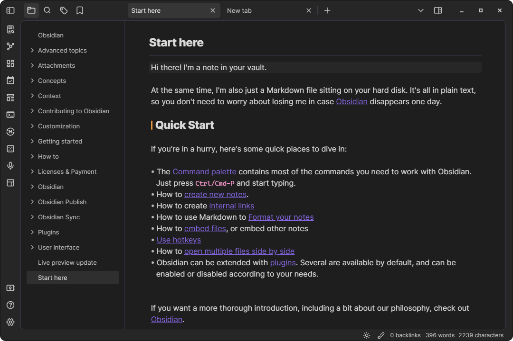
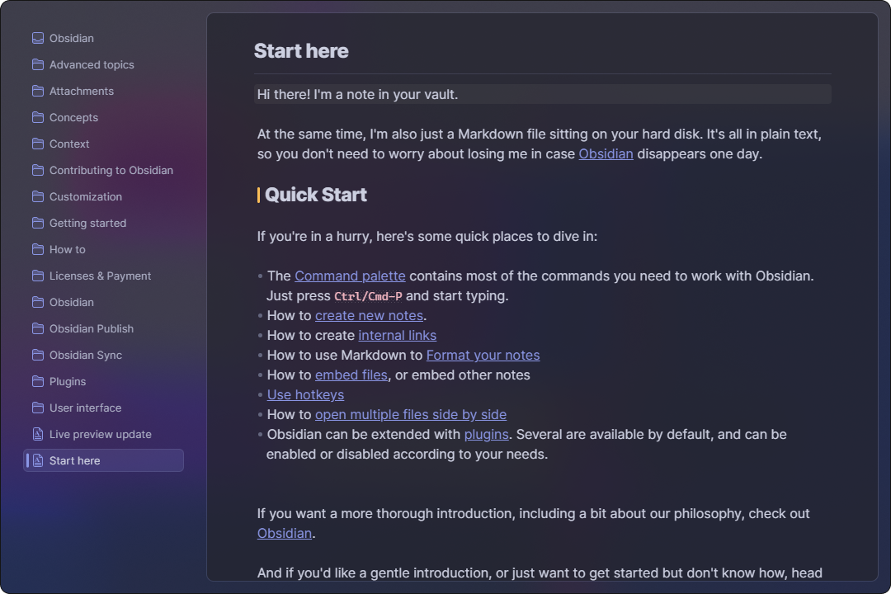
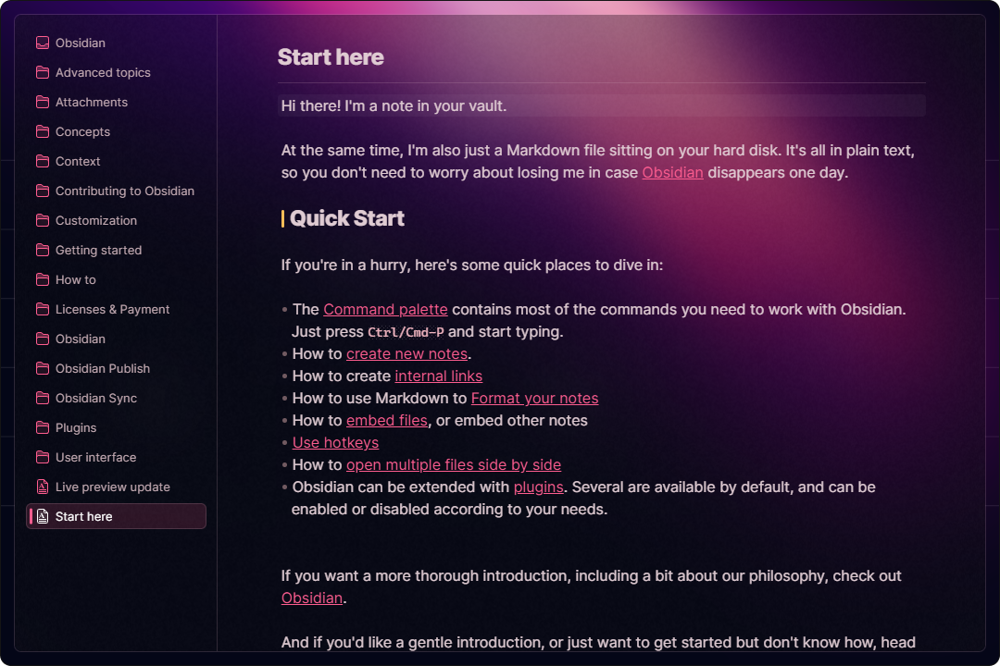
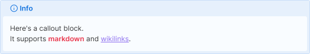

# Presets for [Border theme](https://github.com/Akifyss/obsidian-border)（Updating）

**Usage**: Copy code from link, paste it into style settings and restart obsidian.(Before importing, it is recommended to reset the **Appearance** settings to the default)

**用法**: 复制链接中的代码, 粘贴进style settings中，然后重启obsidian。（导入前，推荐先将**Appearance**配置重置至默认）

---

**Removal**: Click one of the buttons, depending on which mode preset you are using. And maybe need to restart obsidian.

**移除**： 点击其中一个按钮，取决于你正在使用的模式预设。 可能还需要重启obsidian。

---

## Light Mode

+ [Obsidian-default-light](https://github.com/Akifyss/obsidian-border/blob/main/presets/Obsidian-default-light.json)

  + [Obsidian-default-light-alt](https://github.com/Akifyss/obsidian-border/blob/main/presets/Obsidian-default-light-alt.json)

+ [Eye-friendly](https://github.com/Akifyss/obsidian-border/blob/main/presets/Eye-friendly.json)

+ [Rosé Pine Dawn](https://github.com/Akifyss/obsidian-border/blob/main/presets/Rosé-Pine-Dawn.json) (Palette from [Rosé Pine](https://rosepinetheme.com/palette))

+ [Fresh](https://github.com/Akifyss/obsidian-border/blob/main/presets/Fresh.json)

  + [Mint](https://github.com/Akifyss/obsidian-border/blob/main/presets/Mint.json)
  

+ [Paper-like](https://github.com/Akifyss/obsidian-border/blob/main/presets/Paper-like.json)

+ [Borderless-light](https://github.com/Akifyss/obsidian-border/blob/main/presets/Borderless-light.json) (credit [@kneecaps](https://github.com/7368697661))

+ [Boundary](https://github.com/Akifyss/obsidian-border/blob/main/presets/Boundary.json)

  + [Silver](https://github.com/Akifyss/obsidian-border/blob/main/presets/Silver.json)
  

+ [Neumorphism](https://github.com/Akifyss/obsidian-border/blob/main/presets/Neumorphism.json)

+ [Shore](https://github.com/Akifyss/obsidian-border/blob/main/presets/Shore.json)

+ [Side](https://github.com/Akifyss/obsidian-border/blob/main/presets/Side.json)

## Dark Mode

+ [Obsidian-default-dark](https://github.com/Akifyss/obsidian-border/blob/main/presets/Obsidian-default-dark.json)

  + [Obsidian-default-dark-alt](https://github.com/Akifyss/obsidian-border/blob/main/presets/Obsidian-default-dark-alt.json)

+ [Rosé Pine](https://github.com/Akifyss/obsidian-border/blob/main/presets/Rosé-Pine.json) (Palette from [Rosé Pine](https://rosepinetheme.com/palette))

+ [Rosé Pine Moon](https://github.com/Akifyss/obsidian-border/blob/main/presets/Rosé-Pine-Moon.json) (Palette from [Rosé Pine](https://rosepinetheme.com/palette))

+ [Dracula](https://github.com/Akifyss/obsidian-border/blob/main/presets/Dracula.json) (Palette from [Dracula](https://github.com/dracula/dracula-theme))

+ [Translucent](https://github.com/Akifyss/obsidian-border/blob/main/presets/Translucent.json)
(**Extra step**: Enable "translucent window" in Setting-Appearance)

+ [Glassmorphism](https://github.com/Akifyss/obsidian-border/blob/main/presets/Glassmorphism.json)

+ [Borderless](https://github.com/Akifyss/obsidian-border/blob/main/presets/Borderless.json)

+ [Sunset](https://github.com/Akifyss/obsidian-border/blob/main/presets/Sunset.json)

  + [Lightup](https://github.com/Akifyss/obsidian-border/blob/main/presets/Lightup.json)
  

  + [Lightup-alt](https://github.com/Akifyss/obsidian-border/blob/main/presets/Lightup-alt.json)
  

+ [Lightdown-green](https://github.com/Akifyss/obsidian-border/blob/main/presets/Lightdown-green.json) ([wallpaper source](https://twitter.com/JimDesignsCo/status/1634618698353848321))

  + [Lightdown-pink](https://github.com/Akifyss/obsidian-border/blob/main/presets/Lightdown-pink.json) ([wallpaper source](https://twitter.com/JimDesignsCo/status/1634618698353848321))
  

  + [Lightdown-blue](https://github.com/Akifyss/obsidian-border/blob/main/presets/Lightdown-blue.json) ([wallpaper source](https://twitter.com/JimDesignsCo/status/1634618698353848321))
  

  + [Lightdown-orange](https://github.com/Akifyss/obsidian-border/blob/main/presets/Lightdown-orange.json) ([wallpaper source](https://twitter.com/JimDesignsCo/status/1634618698353848321))
  

  + [Justblack](https://github.com/Akifyss/obsidian-border/blob/main/presets/Justblack.json) 

## Callout style

+ [Callout-alt-1](https://github.com/Akifyss/obsidian-border/blob/main/presets/Callout/Callout-alt-1.json) 

+ [Callout-alt-2](https://github.com/Akifyss/obsidian-border/blob/main/presets/Callout/Callout-alt-2.json) 

+ [Callout-alt-3](https://github.com/Akifyss/obsidian-border/blob/main/presets/Callout/Callout-alt-3.json) 

+ [Callout-alt-4](https://github.com/Akifyss/obsidian-border/blob/main/presets/Callout/Callout-alt-4.json) 

Updating...

# Create your own UI style

Here are some useful websites:

+ Gradient background
  + <https://more.graphics/css-gradient>
  + <https://csshero.org/mesher/>
  + <https://gradienta.io/>
+ Animated background
  + <https://giphy.com/>
  + <https://gifer.com/en/>
+ Textures/Pattern
  + <https://www.transparenttextures.com/>
  + <https://pattern.monster>
  + <https://www.magicpattern.design/tools/css-backgrounds>
  + <https://screenspan.net/polka/>
  + <https://patternpad.com/editor.html>
  + <https://superdesigner.co/tools/svg-backgrounds>
  + <https://www.visiwig.com/>
  + <https://tylify.app/>
+ SVG
  + <https://www.svgbackgrounds.com/>
  + <https://app.haikei.app/>
  + <https://app.heazy.studio/>
  + <https://fffuel.co/>
  + <https://svgwave.in/>
  + <https://www.shapedivider.app/>
  + <https://wickedbackgrounds.com/app>
  + <https://bgjar.com/>
+ CSS
  + <https://getcssscan.com/css-box-shadow-examples>
  + <https://uiverse.io/all>
  + <https://markodenic.com/tools/buttons-generator/>
  + <https://neumorphism.io>
+ Tools/Knowledge
  + <https://www.svgbackgrounds.com/tools/svg-to-css/>
  + <https://developer.mozilla.org/en-US/docs/Web/CSS/background>
  + <https://developer.mozilla.org/en-US/docs/Web/CSS/box-shadow>
