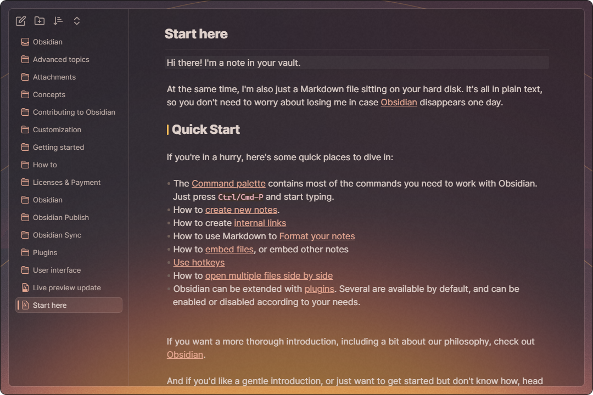

# Presets

**Usage**: Copy code from link, paste it into style settings and restart obsidian.

**用法**: 复制链接中的代码, 粘贴进style settings中，然后重启obsidian。

## Light Mode

+ [Fresh](https://github.com/Akifyss/obsidian-border/blob/main/presets/Fresh.json)

+ [Paper-like](https://github.com/Akifyss/obsidian-border/blob/main/presets/Paper-like.json)

+ [Boundary](https://github.com/Akifyss/obsidian-border/blob/main/presets/Boundary.json)

+ [Mint](https://github.com/Akifyss/obsidian-border/blob/main/presets/Mint.json)

## Dark Mode

+ [Translucent](https://github.com/Akifyss/obsidian-border/blob/main/presets/Translucent.json)
(**Extra step**: Enable "translucent window" in Setting-Appearance)

+ [Lightup](https://github.com/Akifyss/obsidian-border/blob/main/presets/Lightup.json)

+ [Glassmorphism](https://github.com/Akifyss/obsidian-border/blob/main/presets/Glassmorphism.json)

+ [Sunset](https://github.com/Akifyss/obsidian-border/blob/main/presets/Sunset.json)

Updating...
